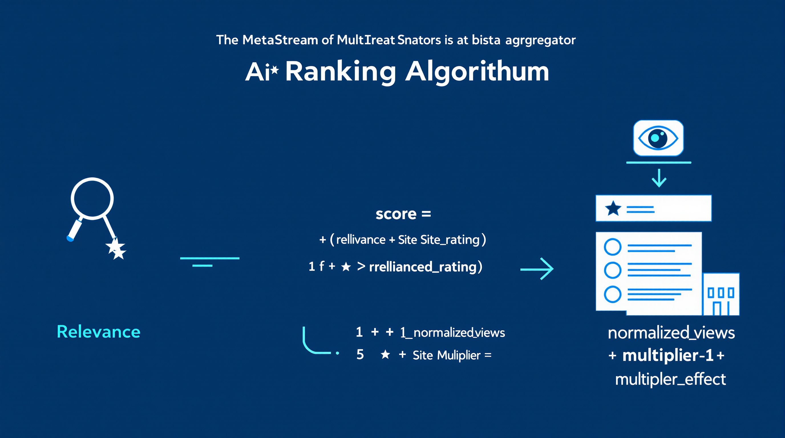

# MetaStream Aggregator - Ranking Algorithm Documentation

This document provides a detailed explanation of the ranking algorithm used in the MetaStream Aggregator application.



## Overview

The MetaStream Aggregator uses a sophisticated ranking algorithm to sort search results based on multiple factors. This ensures that the most relevant and highest quality results appear at the top, while still allowing for discovery of content from smaller sites.

## Key Factors

The ranking algorithm considers four primary factors:

1. **Relevance**: How closely the content matches the search query
2. **Site Rating**: The rating/score provided by the source site
3. **View Count**: How many views the content has received
4. **Site Popularity Multiplier**: A configurable factor that can boost or reduce scores from specific sites

## The Formula

The basic ranking formula is:

```
score = ((relevance * relevance_weight) +
         (normalized_rating * rating_weight) +
         (normalized_views * views_weight)
        ) * (1 + (multiplier-1) * multiplier_effect)
```

Where:
- `relevance` is a calculated measure of how well the result matches the query
- `normalized_rating` is the site's rating converted to a 0-1 scale
- `normalized_views` is the view count normalized logarithmically to a 0-1 scale
- `multiplier` is the site's popularity_multiplier value
- The weight values determine how much each factor contributes to the final score

## Component Calculations

### Relevance Calculation

Relevance is calculated based on how well the title (and description if available) matches the search query:

```python
def calculate_relevance(title, query):
    """Calculate relevance score based on query term matches."""
    # Convert to lowercase for case-insensitive comparison
    title_lower = title.lower()
    query_lower = query.lower()
    
    # Split query into terms
    query_terms = query_lower.split()
    
    # Calculate basic score based on term presence
    total_weight = 0
    matches = 0
    
    for term in query_terms:
        # Term is present
        if term in title_lower:
            matches += 1
            
            # Extra weight for terms at the beginning
            if title_lower.startswith(term):
                total_weight += 1.5
            else:
                total_weight += 1
                
            # Additional weight based on term frequency
            term_count = title_lower.count(term)
            if term_count > 1:
                total_weight += 0.5 * (term_count - 1)
    
    # Calculate exact phrase match bonus
    if len(query_terms) > 1 and query_lower in title_lower:
        total_weight += 2  # Significant bonus for exact phrase match
    
    # Normalize by query length for fair comparison
    # Base score of 1 + additional weights
    if query_terms:
        base_score = matches / len(query_terms)
        return 1 + (base_score * 4) + total_weight
    
    return 1  # Default score for empty queries
```

This gives higher scores to results that:
- Contain more of the query terms
- Have query terms at the beginning of the title
- Contain the exact query phrase
- Have multiple occurrences of query terms

### Rating Normalization

Site ratings are normalized to a 0-1 scale:

```python
def normalize_rating(rating_str):
    """Normalize rating to a 0-1 scale."""
    if not rating_str:
        return 0.5  # Default middle rating if none provided
    
    # Handle percentage format (e.g., "85%")
    if '%' in rating_str:
        try:
            percentage = float(rating_str.replace('%', '').strip())
            return percentage / 100
        except ValueError:
            pass
    
    # Handle X/Y format (e.g., "4.5/5", "8.7/10")
    if '/' in rating_str:
        try:
            parts = rating_str.split('/')
            numerator = float(parts[0].strip())
            denominator = float(parts[1].strip())
            if denominator > 0:
                return numerator / denominator
        except (ValueError, IndexError):
            pass
    
    # Handle plain numeric format (assume out of 10)
    try:
        value = float(rating_str.strip())
        if 0 <= value <= 10:
            return value / 10
        elif 0 <= value <= 5:  # Likely a 5-star rating
            return value / 5
        elif 0 <= value <= 100:  # Likely a percentage
            return value / 100
    except ValueError:
        pass
    
    # Default fallback
    return 0.5
```

### View Count Normalization

View counts are normalized using a logarithmic scale to prevent extremely popular videos from completely dominating the results:

```python
def normalize_views(views_str, max_views=None):
    """Normalize view count on a logarithmic scale."""
    if not views_str:
        return 0.3  # Default moderate view count
    
    views = parse_view_count(views_str)
    
    if views <= 0:
        return 0.1
    
    # Logarithmic normalization ensures a reasonable scale
    # even with huge differences in view counts
    log_views = math.log10(max(1, views))
    
    # If we have the max views in the result set, normalize to that
    if max_views and max_views > 0:
        log_max = math.log10(max(1, max_views))
        if log_max > 0:
            return log_views / log_max
    
    # Otherwise use a reasonable baseline (10M views = 1.0)
    return min(1.0, log_views / 7.0)  # log10(10M) ≈ 7
```

The `parse_view_count` function handles various formats like "1.2M", "10K", etc.:

```python
def parse_view_count(views_str):
    """Parse view count from string format to integer."""
    if not views_str:
        return 0
    
    # Clean the string
    clean_str = views_str.strip().lower().replace(',', '')
    
    # Handle K/M/B suffixes
    if 'k' in clean_str:
        try:
            return int(float(clean_str.replace('k', '')) * 1000)
        except ValueError:
            pass
    elif 'm' in clean_str:
        try:
            return int(float(clean_str.replace('m', '')) * 1000000)
        except ValueError:
            pass
    elif 'b' in clean_str:
        try:
            return int(float(clean_str.replace('b', '')) * 1000000000)
        except ValueError:
            pass
    
    # Handle plain numbers
    try:
        return int(float(clean_str))
    except ValueError:
        return 0
```

### Site Multiplier Effect

The site multiplier effect allows for adjusting the importance of different sites:

```
final_score = base_score * (1 + (multiplier-1) * multiplier_effect)
```

Where:
- `base_score` is the weighted sum of relevance, rating, and views
- `multiplier` is the site's popularity_multiplier value (typically 0.7-1.3)
- `multiplier_effect` controls how strongly the multiplier affects the final score

With a default `multiplier_effect` of 0.1:
- A site with a multiplier of 1.3 would get a 3% boost (1 + (1.3-1)*0.1 = 1.03)
- A site with a multiplier of 0.7 would get a 3% penalty (1 + (0.7-1)*0.1 = 0.97)

## Tuning the Algorithm

The weights for each component can be adjusted in the settings.json file:

```json
"scoring_weights": {
  "relevance_weight": 0.50,
  "rating_weight": 0.30,
  "views_weight": 0.10,
  "multiplier_effect": 0.10
}
```

### Recommended Configurations

#### For Precision (Finding Exactly What You Searched For)
```json
"scoring_weights": {
  "relevance_weight": 0.80,
  "rating_weight": 0.10,
  "views_weight": 0.05,
  "multiplier_effect": 0.05
}
```

#### For Quality (Finding Highest Rated Content)
```json
"scoring_weights": {
  "relevance_weight": 0.30,
  "rating_weight": 0.60,
  "views_weight": 0.05,
  "multiplier_effect": 0.05
}
```

#### For Popularity (Finding Most Viewed Content)
```json
"scoring_weights": {
  "relevance_weight": 0.30,
  "rating_weight": 0.20,
  "views_weight": 0.45,
  "multiplier_effect": 0.05
}
```

#### For Discovery (Finding Content from Niche Sites)
```json
"scoring_weights": {
  "relevance_weight": 0.40,
  "rating_weight": 0.20,
  "views_weight": 0.10,
  "multiplier_effect": 0.30
}
```

## Duplicate Detection

The ranking algorithm includes a step to detect and handle duplicate content found across multiple sites:

1. After initial scoring, the system looks for potential duplicates based on:
   - Similar titles (using string similarity measures)
   - Matching duration (within a small tolerance, e.g., ±5 seconds)
   
2. When duplicates are found, they are grouped together, with:
   - The highest-scoring result becoming the "primary" result
   - All other duplicates becoming "alternate" sources
   
3. Only the primary result is displayed in the main results list, but with indicators showing that alternatives are available

This prevents the same content from appearing multiple times in the results while still providing access to alternative sources.

## Implementation Details

The ranking process follows these steps:

1. Calculate individual raw scores for all results
2. Detect and group duplicates
3. Sort results by final score in descending order
4. Apply pagination to limit results per page
5. Verify link validity (if enabled)
6. Return the final sorted, paginated, and verified results

## Performance Considerations

The ranking algorithm is designed to be efficient even with large result sets:

- Normalization is performed once per result
- Duplicate detection uses optimized comparison techniques
- Scoring calculations use simple arithmetic operations

For very large result sets (1000+ results), the duplicate detection can be the most computationally intensive part of the process.